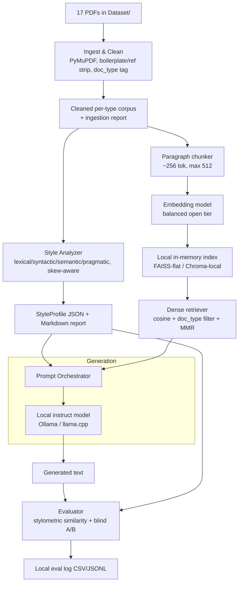

# Personal Style LLM — Consolidated Spec (Right-Sized v1)

> **Single source of truth.** This file replaces the earlier multi-file spec set
> (`plan.md`, `.kiro/specs/personal-style-llm/{requirements,design,tasks}.md`).
> It is deliberately scoped to what a **17-document, single-author, single-user,
> local** project actually needs. Everything that was enterprise MLOps scaffolding
> has been moved to the [Deferred v2 backlog](#12-deferred-v2-backlog) and gated on
> v1 evaluation results.
>
> **Model/pricing note (as-of 2026-07-26):** all named models and embedding
> models below are *tier* recommendations with a current-generation example.
> Model availability, licenses, and any hosted pricing rot fast — **verify against
> the provider's live page before committing.**

---

## 1. Why this is right-sized (measured, not assumed)

The corpus was extracted and profiled directly (not estimated):

| Fact | Value |
|---|---|
| Documents | 17 PDFs (personal statements, cover letters, IAs, assignments, one Extended Essay) |
| Total text | ~93,900 words / ~122k tokens / 698 KB extracted text |
| Full RAG index size | **166–508 chunks** depending on strategy (measured across 4 strategies) |
| **Corpus skew** | **`EE.pdf` alone = 64,830 words = 69% of the entire corpus** |

Consequences that drive every design decision here:

1. **The whole index fits in memory.** ~300–500 chunks → brute-force cosine is
   sub-millisecond. A server-based vector DB, hybrid BM25, and a cross-encoder
   reranker are unjustified at this scale. → **Dense, in-memory retrieval for v1.**
2. **The style signal is dominated by one document.** Un-weighted, the "style
   profile" and any fine-tune would mostly learn the Extended Essay. → **Skew-aware,
   per-document-type analysis is mandatory.**
3. **~122k tokens is a tiny fine-tuning set, 69% of it one essay.** QLoRA here will
   tend to memorize, not generalize. → **v1 is prompt-based; fine-tuning is deferred
   and gated on measured need.**
4. **Style retrieval has no factual ground truth.** For "write me a cover letter"
   there is no single "correct" passage to retrieve, so a `Hit@5 ≥ 0.85` target is
   unmeasurable as written. → **Retrieval is judged by downstream generation quality
   (blind A/B), not Hit@K.**
5. **`BLEU-4` against the corpus rewards n-gram overlap** — i.e. it rewards
   memorization/plagiarism, the exact failure mode here. → **Dropped from v1 metrics.**
6. **Generic sentence-embedding cosine encodes topic, not style.** → v1's primary
   automated style metric is a **stylometric distance** over the lexical/syntactic
   feature vector we already compute, not embedding cosine.

---

## 2. Scope

### In scope (v1)
- Local, single-user, offline pipeline (no auth, no multi-tenancy, no network deploy).
- PDF→text ingestion with boilerplate/reference cleaning and per-doc-type tagging.
- Multi-dimensional **style analysis report** (the primary v1 deliverable).
- Local, in-memory **dense retrieval** of style exemplars.
- **Prompt-based generation** using a local model (style profile + retrieved
  exemplars + few-shot).
- **Evaluation**: stylometric similarity + blind A/B human rating.

### Explicitly deferred to v2 (see §12), each gated on v1 evidence
QLoRA fine-tuning · hybrid dense+BM25 retrieval · cross-encoder reranker ·
server vector DB · Redis cache · FastAPI service with auth/rate-limiting ·
Docker/K8s/canary/blue-green · Prometheus/Grafana/OpenTelemetry · DVC/MLflow
registry · PII redaction as a hard gate · immutable audit log · style-drift monitor.

### Non-goals
- Serving other users or exposing a public API.
- Uploading the corpus to any third-party API. **Privacy here = keep it local and
  offline**, not RBAC + encryption-at-rest infrastructure.

---

## 3. Requirements (v1)

Written as user stories + acceptance criteria. Numbering is stable; properties in
§9 reference these.

### R1 — Corpus ingestion & cleaning
*As the author, I want my PDFs turned into clean, per-type-tagged text so downstream
analysis isn't polluted by extraction noise.*

1. The pipeline SHALL extract text from each PDF (PyMuPDF/`pdfplumber`), normalize to
   UTF-8, and strip repeated boilerplate: running headers/footers, page numbers, and
   the reference/bibliography sections of the Extended Essay.
2. The pipeline SHALL tag each document with a `doc_type` ∈
   {`personal_statement`, `cover_letter`, `academic_ia`, `assignment`, `reflection`,
   `extended_essay`}.
3. The pipeline SHALL record a per-document token count and flag any single document
   exceeding **40% of total corpus tokens** as *dominant* (currently `EE.pdf`), so
   later stages can down-weight or segment it.
4. The pipeline MAY run a light PII pass (redact obvious emails/phone numbers) as a
   **soft, logged** step — not a hard gate, since the corpus stays local.
5. The pipeline SHALL emit an ingestion report: document count, per-type token
   distribution, dominant-document flag, and any extraction warnings.

### R2 — Multi-dimensional style analysis (primary v1 deliverable)
*As the author, I want a report that captures how I write, per document type, not
just a single averaged number.*

1. The analyzer SHALL compute **lexical** (type-token ratio, MTLD, top n-gram
   frequencies), **syntactic** (mean sentence length, POS distribution, mean parse
   depth, clause density), **semantic** (topic clusters; a style embedding centroid),
   and **pragmatic** (Flesch-Kincaid, formality, mean sentiment, rhetorical-marker
   frequencies) features.
2. The analyzer SHALL compute features **per `doc_type`** and at corpus level, and
   the corpus-level aggregate SHALL be **skew-aware**: the dominant document
   (R1.3) is either down-weighted to its per-type share or segmented so it cannot
   swamp the profile.
3. The analyzer SHALL persist a versioned `StyleProfile` (JSON) and a
   human-readable Markdown report.

### R3 — Chunking & local indexing
*As a developer, I want corpus passages chunked and indexed locally so exemplars can
be retrieved at generation time.*

1. Chunking SHALL be **paragraph-based with a token cap** (target ~256, hard max 512),
   never splitting mid-paragraph. (Corpus-driven: see §7 for measured results.)
2. Each chunk SHALL carry metadata: `doc_id`, `doc_type`, `chunk_index`,
   `token_count`, `style_tags` (from R2), and `content_hash` (SHA-256).
3. Chunks SHALL be embedded and stored in a **local, in-memory index**
   (FAISS-flat, `numpy`, or Chroma running in-process/persistent-local — no server).
4. Re-indexing SHALL be idempotent: identical corpus version → identical index, no
   duplicates (keyed on `content_hash`).

### R4 — Dense style-exemplar retrieval
*As a developer, I want the most stylistically useful passages retrieved for a given
request.*

1. The retriever SHALL perform **dense cosine** search over the local index and
   return top-`k` (default 5) chunks.
2. The retriever SHALL support an optional `doc_type` filter so a cover-letter
   request retrieves cover-letter exemplars.
3. The retriever SHOULD apply light **diversity** (e.g. MMR or dedupe near-duplicate
   chunks) so exemplars are representative, not five near-copies.
4. **No BM25, no cross-encoder reranker in v1.** These are added in v2 *only if*
   §6 evaluation shows a retrieval-attributable gap (§12 gating).

### R5 — Prompt-based generation
*As the author, I want text generated in my voice from a prompt.*

1. Generation SHALL run a **local instruct model** (via Ollama or `llama.cpp`;
   see §8 for the tier).
2. The `PromptOrchestrator` SHALL assemble: a **style-profile summary** (tone,
   formality, complexity, preferred structures), the top-`k` retrieved chunks as
   **few-shot stylistic examples**, and the user prompt.
3. The interface SHALL be a **local CLI or a minimal single-user local endpoint**
   (no auth, no rate limiting). Input: `prompt`, `max_tokens`, optional `doc_type`.
   Output: `generated_text`, `style_similarity`, `exemplars_used`, `latency_ms`.
4. If retrieval yields nothing, generation SHALL proceed with the style-profile
   summary alone.

### R6 — Evaluation
*As the author, I want to know objectively and subjectively whether output matches my
style.*

1. For each generation the evaluator SHALL compute a **stylometric similarity**:
   distance between the generated text's feature vector (R2 dimensions) and the
   author's profile. This — **not** embedding cosine, **not** BLEU — is the primary
   automated metric.
2. The evaluator SHALL support **blind A/B**: for the same prompt, present the local
   model *with* the style profile + exemplars vs. *without* (plain prompt), labels
   hidden; the author records a preference.
3. Retrieval quality SHALL be judged **indirectly** via A/B outcomes and via optional
   exemplar-diversity/coverage checks — **not** via a `Hit@K` factual target.
4. Results SHALL be logged to a local file (CSV/JSONL) the author can review.

### R7 — Reproducibility & local hygiene
1. Config SHALL be **config-as-code** (a single YAML/TOML) with fixed random seeds.
2. Code SHALL be versioned in **git**; large artifacts (index, model files) stay
   local and git-ignored. (DVC/MLflow are v2, not required at this scale.)
3. The corpus and all derived artifacts SHALL remain **on local disk**; nothing is
   sent to a third-party API.

---

## 4. Architecture (local-first)



Six small modules, one process, no services:

| Module | Responsibility | Key libs (verify current versions) |
|---|---|---|
| `ingest` | PDF→text, clean, tag, report | PyMuPDF/`pdfplumber`, `langdetect` |
| `style_analyzer` | feature extraction, skew-aware profile, report | spaCy, NLTK, `scikit-learn`, `sentence-transformers`, BERTopic (or KMeans) |
| `index` | chunk, embed, local index, idempotent rebuild | `sentence-transformers`, FAISS-flat / Chroma-local |
| `retrieve` | dense cosine + `doc_type` filter + MMR | numpy / FAISS |
| `generate` | prompt orchestration + local model call | Ollama or `llama.cpp` (`llama-cpp-python`) |
| `evaluate` | stylometric similarity, A/B harness, logging | reuse `style_analyzer` features |

---

## 5. Data models

```python
@dataclass
class Document:
    doc_id: str
    doc_type: str            # personal_statement | cover_letter | academic_ia | assignment | reflection | extended_essay
    text: str                # cleaned, UTF-8
    token_count: int
    is_dominant: bool        # token_count > 40% of corpus total (R1.3)

@dataclass
class StyleProfile:
    version: str
    computed_at: datetime
    # per-dimension features, stored both per-doc_type and corpus-level (skew-aware)
    lexical: dict            # ttr, mtld, top_ngrams
    syntactic: dict          # mean_sentence_len, pos_dist, mean_parse_depth, clause_density
    semantic: dict           # topic_clusters, style_embedding_centroid
    pragmatic: dict          # flesch_kincaid, formality, sentiment, rhetorical_markers
    per_type: dict[str, dict]  # doc_type -> the four dicts above

@dataclass
class Chunk:
    chunk_id: str
    doc_id: str
    doc_type: str
    chunk_index: int
    token_count: int         # <= 512
    style_tags: list[str]
    text: str
    content_hash: str        # SHA-256, for idempotent indexing
    embedding: list[float] | None

@dataclass
class GenerationResult:
    generated_text: str
    style_similarity: float  # stylometric distance-derived score (R6.1)
    exemplars_used: list[str]  # chunk_ids
    latency_ms: int

@dataclass
class ABTrial:
    trial_id: str
    prompt: str
    output_styled: str       # with profile + exemplars (label hidden)
    output_plain: str        # plain prompt (label hidden)
    preferred: Literal["styled", "plain"] | None
    rated_at: datetime | None
```

---

## 6. Evaluation design

**Primary automated metric — stylometric similarity (R6.1).**
Build a feature vector from the R2 dimensions (TTR, MTLD, mean sentence length, POS
distribution, clause density, Flesch-Kincaid, formality, rhetorical-marker rates).
Score = a normalized inverse distance between the generated text's vector and the
author's per-`doc_type` profile vector. Rationale: these features track *how* text is
written; generic embedding cosine tracks *what it's about*.

**Primary subjective metric — blind A/B (R6.2).**
Styled (profile + exemplars) vs. plain, same prompt, labels hidden, author picks.
This is the ground truth for a single-author style task. Target: styled preferred in
a clear majority of trials before declaring v1 a success (set the exact bar with
yourself; start at ≥ 65–70% over ≥ 20 trials).

**Retrieval (R6.3).** No `Hit@K` target — there is no ground-truth relevant passage
for a style request. Judge retrieval by: (a) whether removing exemplars hurts A/B
outcomes, and (b) exemplar diversity/coverage across `doc_type`.

**Dropped from the old spec and why:** `BLEU-4` (rewards memorization), embedding-
cosine as the *primary* style score (measures topic), `Hit@5 ≥ 0.85` (unmeasurable
for style), `Style_Similarity ≥ 0.75` as a hard registration gate (no model to
register in v1).

---

## 7. Chunking — corpus-driven results

Measured on the real extracted corpus (`chunking_optimizer` over 4 strategies):

| Strategy | Total chunks across corpus |
|---|---|
| sentence_based | 166 |
| paragraph_based | 307 |
| semantic_heading | 319 |
| fixed_size_char | 508 |

Notes: PDF extraction yields poor paragraph/heading structure (~12% clean sentence
breaks), which is why boundary-quality heuristics slightly favored fixed-size. For a
**style** corpus, boundary precision matters far less than for factual QA, and
paragraph-coherent exemplars read better in the prompt. **Decision:** paragraph-based
with a 512-token cap (≈307 chunks). The dominant `EE.pdf` should be chunked with the
same rule but its chunks tagged so retrieval/diversity can avoid over-drawing from it.

---

## 8. Model & embedding tiers (verify before use, as-of 2026-07-26)

| Role | Tier | Current-generation example (VERIFY) | Why this tier |
|---|---|---|---|
| Embedding | Balanced open | `bge-large` / `e5-large-v2` / `all-mpnet-base-v2` | Quality without an API dependency; runs locally on a few hundred chunks trivially |
| Generation | Small–mid open instruct, local | a current 7–8B instruct model via Ollama/`llama.cpp` | Local, private, good enough for style-conditioned drafting; **treat the specific model name as a placeholder to verify** |

**Do not** hard-code a model as a fact — pin the *tier*, pick a current model, and
re-check availability/license at build time.

---

## 9. Correctness properties (v1)

Lean set, each mapped to a requirement. Verify with `pytest` (+ Hypothesis where a
property is universal).

- **P1 — Cleaning removes boilerplate.** For any document, cleaned output contains no
  running header/footer or page-number artifacts, and the Extended Essay's reference
  list is excluded. *(R1.1)*
- **P2 — Dominant-doc flagging.** Any document exceeding 40% of corpus tokens is
  flagged `is_dominant`. *(R1.3)*
- **P3 — Skew-aware aggregation.** The corpus-level profile is invariant to
  duplicating the dominant document's chunks beyond its per-type weight (i.e. skew
  down-weighting actually applied). *(R2.2)*
- **P4 — Profile completeness & round-trip.** Every profile has all four dimensions
  per `doc_type`; JSON serialize→deserialize reproduces it within float tolerance.
  *(R2.1, R2.3)*
- **P5 — Chunk invariants.** Every chunk has `token_count ≤ 512`, all metadata fields
  populated, and never splits mid-paragraph. *(R3.1, R3.2)*
- **P6 — Idempotent indexing.** Indexing the same corpus version twice yields
  identical index entries and no duplicates (keyed on `content_hash`). *(R3.4)*
- **P7 — doc_type filter soundness.** When a `doc_type` filter is set, every returned
  chunk matches it. *(R4.2)*
- **P8 — Retrieval bound & diversity.** The retriever returns ≤ `k` chunks and no two
  returned chunks are near-duplicates above a similarity threshold. *(R4.1, R4.3)*
- **P9 — Prompt completeness.** The assembled prompt always contains the style-profile
  summary and the user prompt; exemplars are included when retrieval is non-empty.
  *(R5.2, R5.4)*
- **P10 — Reproducibility.** Same config + seed + corpus version → identical index and
  identical profile. *(R7.1)*

---

## 10. Testing strategy (right-sized)

- **Unit:** cleaners (header/footer/reference strip), TTR/MTLD math, chunk boundary &
  cap, `content_hash` dedupe, `doc_type` filter, stylometric distance.
- **Property (Hypothesis):** P2, P4, P5, P6, P7, P8, P10 above.
- **Integration (real corpus):** run the full pipeline on `Dataset/` end-to-end;
  assert a `StyleProfile` + Markdown report is produced and ~300 chunks index.
- **Human eval:** the blind A/B harness (R6.2) — the real acceptance gate.
- **No** load tests, canary tests, auth tests, or drift-alert tests in v1 (nothing to
  serve or protect yet).

---

## 11. Implementation tasks (incremental)

1. **Ingest & clean** — extract 17 PDFs, strip boilerplate + EE references, tag
   `doc_type`, compute token distribution + dominant flag, emit ingestion report. *(R1)*
2. **Style analyzer** — lexical/syntactic/semantic/pragmatic features, per-type +
   skew-aware corpus profile, JSON + Markdown report. *(R2)* — **primary deliverable.**
3. **Chunk & index** — paragraph chunker (≤512 tok), embed with balanced-open model,
   local FAISS-flat/Chroma index, idempotent rebuild. *(R3)*
4. **Retriever** — dense cosine + `doc_type` filter + MMR diversity. *(R4)*
5. **Generator** — prompt orchestrator (profile summary + exemplars + few-shot),
   local model via Ollama/`llama.cpp`, CLI/local endpoint. *(R5)*
6. **Evaluator** — stylometric similarity + blind A/B harness + local logging. *(R6)*
7. **Config & repro** — single YAML config, seeds, git hygiene, `.gitignore` for
   artifacts. *(R7)*
8. **Checkpoint** — run A/B on real prompts; record results; decide with the author
   whether any v2 item (§12) is warranted.

---

## 12. Deferred v2 backlog (each gated on v1 evidence)

Do **not** build these until the gate is met. One variable at a time.

| Deferred item | Build it only when… |
|---|---|
| **QLoRA fine-tuning (7B)** | A/B shows the prompt path plateaus below your bar *and* the failure is clearly "not enough style internalization," not a prompt/exemplar problem. Watch for memorization of `EE.pdf`. |
| **Hybrid dense + BM25** | Eval traces a miss to exact-lexical terms dense retrieval didn't surface. |
| **Cross-encoder reranker** | Retrieval-attributable A/B losses persist after diversity tuning. |
| **Server vector DB (Weaviate/pgvector)** | Corpus grows past tens of thousands of chunks — not at 17 docs. |
| **Redis retrieval cache** | You observe genuinely repeated identical queries (unlikely for generation). |
| **FastAPI + auth + rate limiting** | You expose the system to someone other than yourself. |
| **Docker/K8s/canary/blue-green, Prometheus/Grafana/OTel** | You run a real multi-user service with uptime obligations. |
| **DVC / MLflow registry** | You have multiple models/datasets to track and reproduce across machines. |
| **PII hard-gate, immutable audit log, encryption-at-rest, RBAC** | You store/serve data beyond your own local disk, or share the corpus. |
| **Style-drift monitor** | You have a deployed model generating at volume over time. |

---

### Provenance
Corpus figures, chunk counts, and the EE-dominance finding in this document were
measured directly from `Dataset/` (17 PDFs) on 2026-07-26, not estimated. Re-measure
if the corpus changes.
